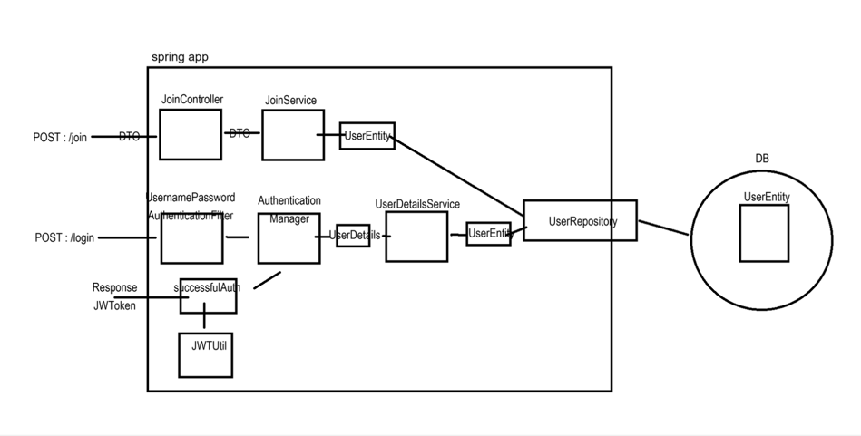
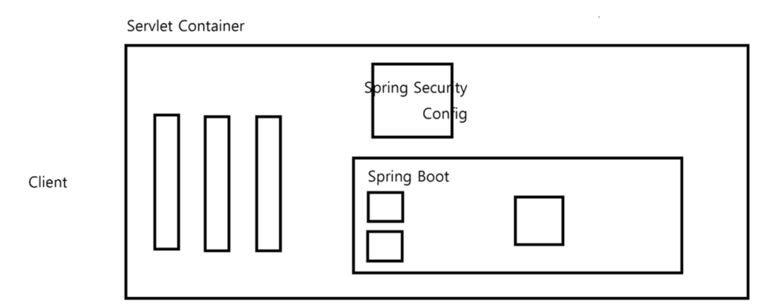
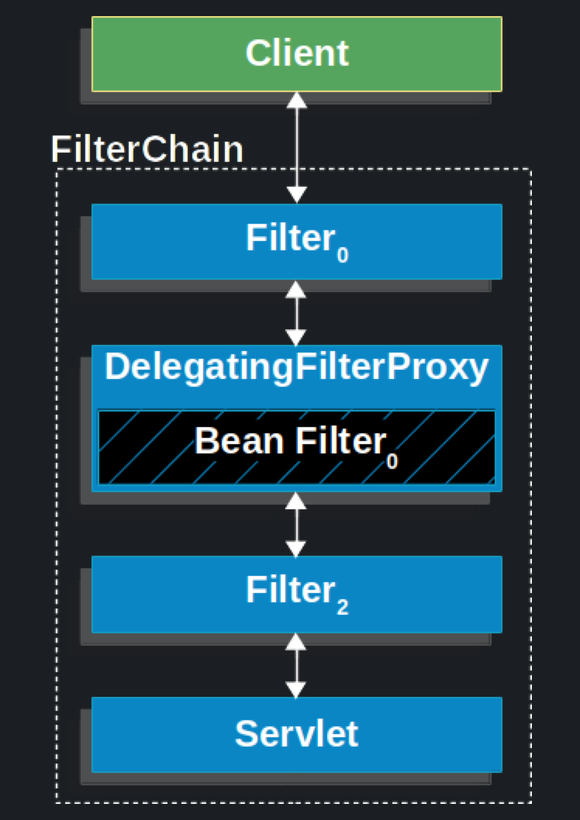

# 유미님의 스프링 시큐리티를 참조하여 JWT를 학습한 내용입니다.


### 로그인 모식도


### 스프링 시큐리티 필터 동작 원리
스프링 시큐리티는 클라이언트의 요청이 여러개의 필터를 거쳐 DispatcherServlet(Controller)으로 향하는 중간 필터에서 요청을 가로챈 후 검증(인증/인가)을 진행한다.

클라이언트 요청 -> 서블릿 필터 -> 서블릿(컨트롤러)




### Delegating Filter Proxy
- 서블릿 컨테이너 (톰캣)에 존재하는 필터 체인에 DelegatingFilter를 등록한 뒤 모든 요청을 가로챈다.




- 서블릿 필터 체인의 DelegatingFilter → Security 필터 체인 (내부 처리 후) → 서블릿 필터 체인의 DelegatingFilter

- 가로챈 요청은 SecurityFilterChain에서 처리 후 상황에 따른 거부, 리디렉션, 서블릿으로 요청 전달을 진행한다.


----
# 심화

- 단일 토큰의 위험성
- Refresh 토큰의 발급
- Access 토큰 만료시 응답 설정
- Refresh 토큰을 통한 Access 갱신
- Refresh Rotate
- 서버측 주도권의 필요성
- 로그아웃 구현
- 메일 알림
- PKCE


---
# 추가 내용 

## 1. 웹스토리지, 세션스토리지, 쿠키

둘 다 브라우저에서 제공하는 웹 스토리지 API
 
localStorage:
```java
// 데이터 저장
localStorage.setItem('accessToken', 'eyJhbG...');

// 데이터 조회
const token = localStorage.getItem('accessToken');

특징:
- 브라우저를 닫아도 데이터 유지
- 도메인별로 독립적인 저장소
- XSS 공격에 취약할 수 있음
```

sessionStorage:
```java
// 데이터 저장
sessionStorage.setItem('refreshToken', 'eyJhbG...');

// 데이터 조회
const token = sessionStorage.getItem('refreshToken');

특징:
- 브라우저/탭을 닫으면 데이터 삭제
- 같은 탭에서만 데이터 공유
- 상대적으로 더 안전
```

쿠키(Cookie) 스토리지:

```java
// 서버에서 설정
response.setHeader("Set-Cookie", "token=123; HttpOnly");

특징:
- 서버와 클라이언트 모두 접근 가능
- 모든 HTTP 요청에 자동으로 포함
- 용량 제한: 약 4KB
- httpOnly 설정으로 JS 접근 차단 가능
- 만료일 설정 가능
```

로컬 스토리지
```java
// 클라이언트에서만 설정
localStorage.setItem('token', '123');

특징:
- 클라이언트(브라우저)에서만 접근 가능
- HTTP 요청에 자동 포함되지 않음
- 용량 제한: 약 5~10MB
- JS로만 접근 가능
- 영구 저장 (직접 삭제하기 전까지)
```

# CSS, XSS
- [CSRF, XSS 설명](https://github.com/PyeonMinjun/inflearn_Spring/commit/c18e7c01dda5caea3823743e365fef5082592269)